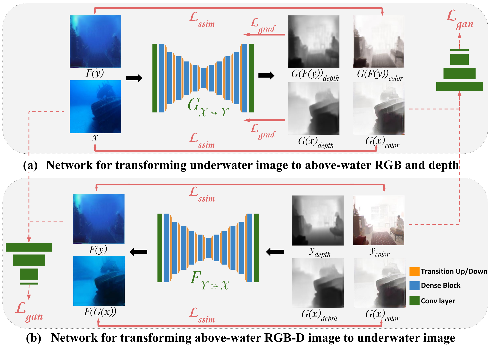
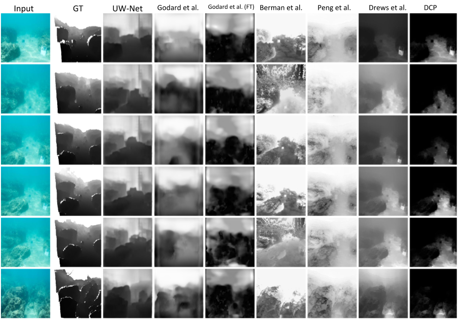

# Unsupervised Single Image Underwater Depth Estimation (UW-Net) [[Project]](http://www.ee.iitm.ac.in/comp_photolab/project-underwater.html) [[Paper]](https://arxiv.org/pdf/1905.10595.pdf) 





This is the TensorFlow implementation for UW-Net. The code was written by [Honey Gupta](https://github.com/honeygupta), but parts of it was borrowed from the [CycleGAN code](https://github.com/leehomyc/cyclegan-1) written by Harry Yang and Nathan Silberman.

## Introduction

This project contains the scripts to train and test UW-Net network. Below figure shows few generated images for the underwater dataset released by [Berman et al.](https://www.eng.tau.ac.il/~berman/UnderwaterColorRestoration/) 
which we had used for qualitative analysis in our paper. 
 


## Getting Started

### Package requirements
 * The following packages are required to run the codes. Note: the version of the packages were the ones we used and are suggestive, not mandatory.
    * python = 3.6
    * click = 7.0
    * tensorflow-gpu = 1.11
    * scikit-image = 0.15

### Prepare dataset
* You can download any existing underwater image dataset or create your own by collecting images from the internet (while considering their copyrights). 
	* Put images from each domain i.e RGBD terrestrial images in the form of .npy files and 2D underwater images in different folders 
* Create the csv file as input to the data loader. 
	* Edit the uwnet_datasets.py file. 
	
	    For example, if your dataset contains 1449 RGBD images and <1449 underwater images as .png files, you can just edit the uwnet_datasets.py as following
	```python
	DATASET_TO_SIZES = {
    'air2water_train': 1449
	}
	PATH_TO_CSV = {
    'air2water_train': 'input/air2water_train.csv'
	}
	DATASET_TO_IMAGETYPE = {
    'air2water_train': '.png'
	}
	``` 
	* Run create_uwnet_dataset.py
	```bash
	python create_uwnet_dataset --image_path_a=/path/to/folder/with/rgbd/npy/files \
     --image_path_b=/path/to/folder/containing/underwater/images --dataset_name="air2water_train"
	```

### Training
* Create the configuration file. The configuration file contains basic information for training/testing. An example of the configuration file could be fond at configs/exp_01.json. 

* Start training:
    ```bash
    python main.py \
        --to_train=1 \
        --log_dir=out/exp_01 \
        --config_filename=configs/exp_01.json
    ```
* Check the intermediate results.
	* Tensorboard
	```bash
	tensorboard --port=6006 --logdir=out/exp_01/#timestamp# 
	```
	* Check the html visualization at  ```out/exp_01/#timestamp#/epoch_#id#.html```  

### Restoring from the previous checkpoint.
```bash
python main.py \
    --to_train=2 \
    --log_dir=out/exp_01 \
    --config_filename=configs/exp_01.json \
    --checkpoint_dir=out/exp_01/#timestamp#
```
### Testing
* Create the testing dataset
	* Edit the uwnet_datasets.py file the same way as training
	    * A sample entry for the dataset by Berman et al. can be found in the script
	* Create the csv file as the input to the data loader. 
    ```bash
    python create_uwnet_dataset --image_path_a=/path/to/folder/with/rgbd/npy/files \
         --image_path_b=/path/to/folder/containing/underwater/images --dataset_name="hazelines"
    ```
    TODO: Remove the requirement of RGBD dataset while testing.
     
* Run testing
    ```bash
    python main.py \
        --to_train=0 \
        --log_dir=out/exp_01_test \
        --config_filename=configs/exp_01_test.json \
        --checkpoint_dir=out/exp_01/#timestamp# 
    ```
The result is saved in out/exp_01_test/#timestamp#. 

In the provided code, the folder ```out/checkpoint/``` contains the model trained on our collected underwater dataset and 
```out/finetune``` contains the model from ```out/checkpoint/``` fine-tuned on Berman et al.'s dataset for 20 epochs.

To test on the pre-trained models, just change the entry for --checkpoint_dir in the above line script.   


